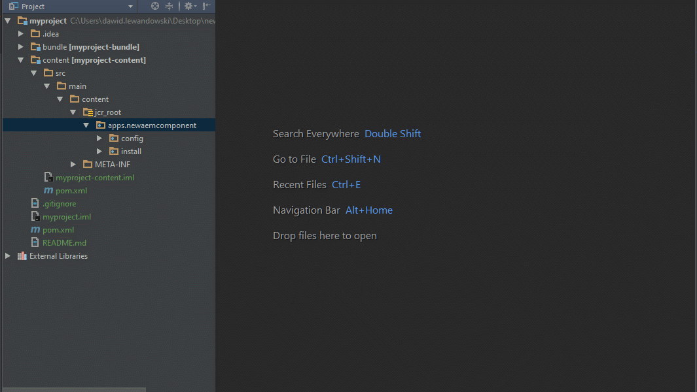

# IntelliJ Shortcuts For AEM

### Goal

Boost AEM components development

  

### What is it and how to use it

*IntelliJ Shortcuts For AEM* are deplyed to *IntelliJ IDEA Plugins* repository. It means that you can install the plugind directly from your IDE. Do to that follow the steps:

 1. Open the *Settings* dialog (*File -> Settings* or *Ctrl+Alt+S*)

 2. Go to *Plugins* section

 * Click *Browse Repositories...* button

 * Type *IntelliJ Shortcuts For AEM*

 * Select the plugin and click *Install* button

### Features

  1. Version 1.0.1
    * Create Sling Folder operation
    * Create AEM Component operation
